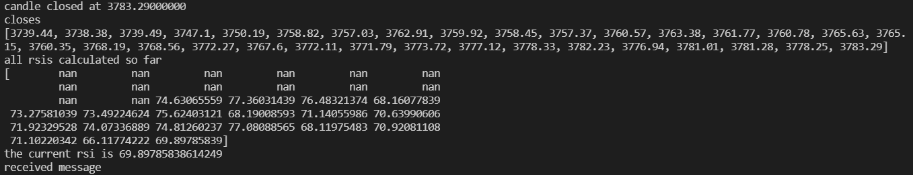

# Python-Crypto-Trading-Bot
Python Crypto Trading Bot in Real-Time to Buy and Sell on Binance that uses Binance API, WebSockets and TA-Lib.

In this project, I have used Python,  TA libraries, Binance API's & Websockets to retrieve Real-time price data and applied Technical Indicators to this pricing data in order to execute Trades automatically using Binance as a Broker. 
## Pre-Requistes:
Python 3.9 - The most popular language for data science, analysis, and machine learning
Python-Binance - Unofficial Python wrapper for the Binance exchange REST API v3 ~ pip install python-binance
TA-Lib - Python wrapper for TA-Lib ~ pip install TA_Lib-0.4.22-cp39-cp39-win_amd64.whl
numpy - library for multi-dimensional arrays and matrices, mathematical functions ~ pip install numpy
Python WebSocketclient - Websocket client for python. This provide the low level APIs for WebSocket ~ pip install websocket-client

Variety of libraries were been installed and imported for this project which include WebSocket Client, JSON data, numpy library, talib, local config file and used pprint to analyze the data coming in from binance. Also to note that all python binance packages will need to installed first. 

In this project, I have used the RSI indicator as my technical indicator to make trades which is consuming the default RSI value like OVERSOLD_THRESHOLD = 30 and OVERBOUGHT_THRESHOLD = 70. 

The data is being recieved from a Websocket for Candle Stick Streams, please find link for your reference [WebSocket Streams for Binance](https://github.com/binance/binance-spot-api-docs/blob/master/web-socket-streams.md#klinecandlestick-streams). I have chosen 1 minute interval for my Candlestick charts interval and my symbol is ethusdt (Etherium). 

All the closing prices are being tracked here for each of the candle sticks so that we initialize a list. Also, the position is being tracked if are in the position to buy/sell. I have intialized the Binance Client so that buy/sell orders can be executed against Binance. 

And then comes the step where the function to order is defined and built.
## In Depth Analysis on How the Crytpo Bot works!
Initially, how it happens is that first a connection is made to a websocket by creating a websocket app which has a socket to listen "SOCKET = wss://stream.binance.com:9443/ws/ethusdt@kline_1m". 

So, we are listening for data that is coming in and we will call different functions whenever we get a new message and when we open a connection "ws = websocket.WebSocketApp(SOCKET, on_open=on_open, on_close=on_close, on_message=on_message). When we run the websocket, each time we recieve a message and we are going to be receiving some pricing data.

When we receive that pricing data, we are going to be processing that pricing data in the form of candle sticks. We are going to look at the close of the candle sticks and apply a technical indicator to those close in real-time. Whenever our RSI is above the overbought threshold, we are going to execute an sell order. Whenever our RSI is below the oversold threshold, we are going to issue a buy order. 

In the pieces of code, you can see that json.loads is added to convert the json string to Python Data Structure. Import pprint will pretty print the format which will be easy to use and interpolate the pricing data.  Import talib and numpy is to apply the RSI indicator to the series of closes (closing prices of each candle stick). 

In order to buy and sell crypto automatically with the help of Binance, we need to be able to pull in the code. Here comes the use of python binance package. Here, Binance.client and Binance.enums is included along with the Client which is required to connect to Binance account for buying and selling trades automatically. And the last thing to do here is to define an order function which is going take the details like symbol, quantity, side type (buy/Sell) and an order type. Once the function was defined, it was then time to call the function from within the Buy Logic and Sell Logic.

The Program ran successfully without any errors. This program can be run overnight and the best part is that we can use different technical indicators to experiment with our Crypto Bot. 

## Binance WebSocket Kline Candlestick Streams Payload Terminology used in the code:
- k = Lenght and Breadth of the candle (includes start time, end time, high/low/close/open price)
- c = Close price of the candlestick
- x = True/ False , it tells us that when x=true that means that a new candlestick formation has started. 
## References: 
- [Binance API Wrapper for Creating Orders and placing a Binance client](https://github.com/sammchardy/python-binance)
- [PythonWebSocketClient Long Lived Connection](https://pypi.org/project/websocket-client/)
- [Binance API WebSocketStreams - KlineCandleStickStreams](https://github.com/binance/binance-spot-api-docs/blob/master/web-socket-streams.md#klinecandlestick-streams)
- [TA-Lib RSI Indicator](https://mrjbq7.github.io/ta-lib/)

## Challenges:
I had a few challenges when it came to installing numpy and talib modules. I ran into an error "modulenotfounderror: no module named 'numpy'". In order to help resolve the fix, I navigated to the Python Scripts Directory (Python C:\Python\Python3.9\Scripts). Coopy the Scripts Directoyr Path (Python C:\Python\Python3.9\Scripts) . Now launch "CMD" with Administrator Rights, go to the Scripts path by pasting "cd C:\Python\Python3.9\Scripts" in CMD window. Now, enter the command "pip install numpy". 

Similar was the case for TA-Lib. Be sure to save the .whl file under Python Scripts Directory and then run the command "pip install TA_Lib-0.4.22-cp39-cp39-win_amd64.whl" from CMD Window to install TA-Lib. 
